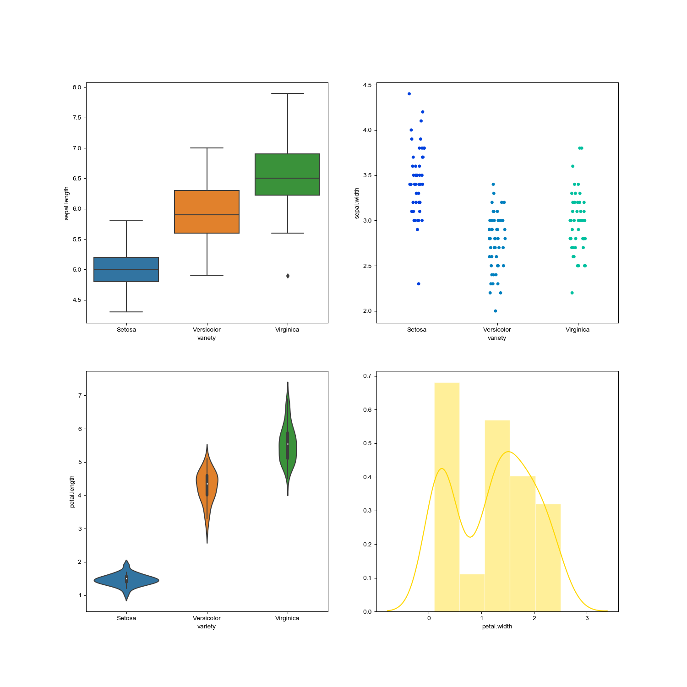
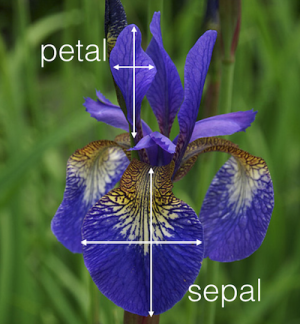
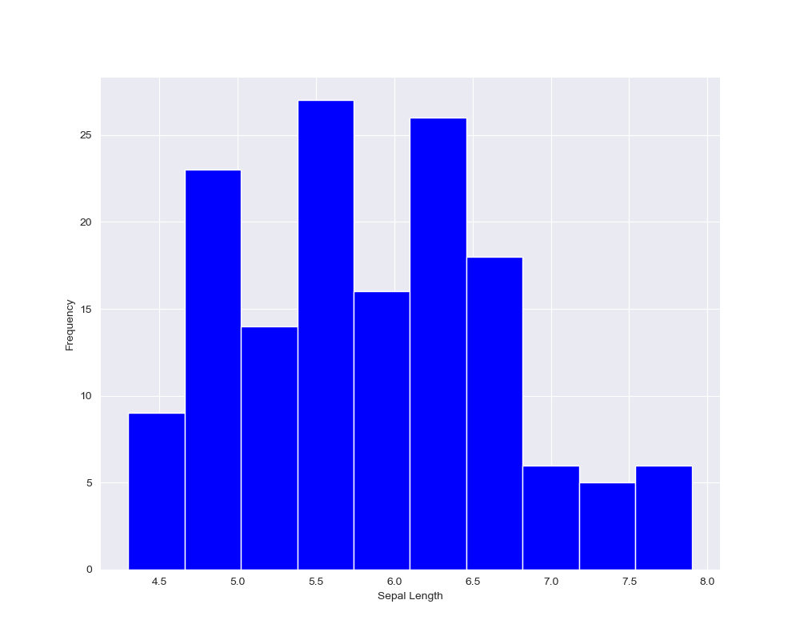

# Pands-Project 2020 
## Keith Brazill - G00387845
### Analysis of the Iris Flower Data Set using Python.


Dashboard of Dataset (source: Developed by Keith Brazill)

# Introduction

This README document outlines the learners (Keith Brazill) approach, methodology and analysis on the Iris Flower Data Set for the Programming and Scripting assignment 2020, as part of the requirements for partial fullfilment of a postgraduate diploma in Computer Science with Data Analytics. 

The README is structured as follows:
1. Background and Context: The history of the Iris Flower data set and its key attributes are described. This section also describes how this data set has been used in the field of computer science.
2. Analysis of the Iris Flower Data Set: The data set is analysed using Python. Summaries of the data are captued in text and visual data (plots) and more detailed analysis is then carried out on the data set and results are also outputted to text and visualisations. 
3. Machine Learning: Further analysis is carried out on the data set and machine learning algorithims are used to calculate the species type based on the inputted petal and sepal dimensions. 
4. Conculusion: Concluding remarks reflecting the learners findings and self reflection are included in the conclusion. 
5. References: Finally all references used in the analysis are included.


# 1. Background and Context

The Iris Flower Data Set is a multivariate type data set that was developed by Ronald Fisher in his paper the "The use of Multiple Measurements in Taxonomic Problems." The data set is well know in the field of pattern recognition literature and is very frequently referenced in modern day literature, particulary in a field of significant importance to the learner, which is machine learning. 
The data set contains three classes of fifty instances that each refer to a species type of the iris plant.

The key attribute information in the paper are as follows:

1. sepal length in cm
2. sepal width in cm
3. petal length in cm
4. petal width in cm
5. class:

     *Iris Setosa* | `Iris Versicolor` | **Iris Viriginica**
    --- | --- | ---
     |  | 
Iris Flower Species (source: https://en.wikipedia.org/wiki/Iris_flower_data_set) 
    


Iris Attributes (source: https://www.ritchieng.com/machine-learning-iris-dataset/)

The Iris Data Set is commonly referenced in computer science. The Iris flower data set is widely used as an input testing method for new types of sorting models and taxonomy algorithims to determine how various technologies can handle data sets. For example Wu et al. (2017) refered to the data set in their paper "Enhanced Classification Models for Iris Dataset," which focused on creating an induction algorithim for randomized decision trees. The dataset is widely used for beginners to understand machine learning, and it this is also an intention for this project to delve into the world of machine learning. A demonstration of the popularity of the dataset in machine learning is the fact that the widely used machine learning package Scikit-learn has the iris data set already built into it which can be accessed by the following python code:

```python
from sklearn.datasets import load_iris
```
The large American multinational technology company (IBM) which produces computer hardware, software and provides hosting and consulting services, have used the Iris flower data set to test many of their machine learning algorithims. 

# 2 Analysing the Iris Flower Data Set
## 2.1 Libraries

The first step in analysing the data is to import the relevant libraries required to visualise the data in Python. Several hours research was carried out to determine the appropriate libraries to use for this project.

```python
import numpy as np
import pandas as pd
import seaborn as sns
import matplotlib.pyplot as plt
from pandas.plotting import parallel_coordinates
```
All of the above libraries were pre-installed by Anaconda while installing Python. The following libaries were used:

* Numpy: Numpy is a library for python that supports arrays and hugh level mathematical functions. It is used in this project for mathematical calculations on the data and arranging the data numerically.
* Pandas: Pandas is a software library for Python for data manipulation and analysis. It is used in this project for reading files and managing data.
* Matplotlib.pyloy: Matplotlib is a library for plotting the python language and its extension Numpy. It is used for plotting the data in this project.
* Seaborn: Seaborn is a python data library to create visualisations based on matplotlib. Seaborn was specifically chosen for this project due to the attractive and informative graphical output.

## 2.2 The Data Set

Following importing of the libraries the data set was imported by telling Pandas (pd) to read the CSV file of the dataset. The different species and their locations in the data set are also defined which are used further in the analysis.

```python
iris = pd.read_csv('Iris_data.txt')
setosa=iris[iris['variety']=='Setosa']
versicolor=iris[iris['variety']=='Versicolor']
virginica=iris[iris['variety']=='Virginica']
```
The CSV file was sourced from the UCI Machine Learning Repository available at: http://archive.ics.uci.edu/ml/datasets/Iris. 

## 2.3 Summary of the Data

Following the loading of the CSV file we then want to get a high level understanding of the dataset. This is carried out by printing the head (the first 5 rows of the data), grouping the different species and count, the shape of the data (how many rows and columns in x,x format), a description of the data (count, mean, std, median, min, max and upper and lower quartiles) and the correlation between the different variables of the data set to a text file. 

```python
txt = open("00_Iris_Analysis_Output.txt", "w")
print(iris.head(5), file=txt)
print("The species of Iris are", iris.groupby('variety').size(), file=txt)
print(iris.shape, file=txt)
print(iris.describe(), file=txt)
print(iris.corr(), file=txt)
```
All of the output is automatically saved to the text file "00_Iris_Analysis_Output.txt" and is overwritten each time the program is ran. 

Head of the data shows each of the main attributes and format of the data:

```
 sepal.length  sepal.width  petal.length  petal.width variety
0           5.1          3.5           1.4          0.2  Setosa
1           4.9          3.0           1.4          0.2  Setosa
2           4.7          3.2           1.3          0.2  Setosa
3           4.6          3.1           1.5          0.2  Setosa
4           5.0          3.6           1.4          0.2  Setosa
```
The species area setosa, versicolor and virginica and there is 50 of each:

```
The species of Iris are variety
Setosa        50
Versicolor    50
Virginica     50
```
The shape of the data is 150 rows and 5 columns:
```
(150, 5)
```
The outputs of the description of the data are provided below:
```
sepal.length  sepal.width  petal.length  petal.width
count    150.000000   150.000000    150.000000   150.000000
mean       5.843333     3.057333      3.758000     1.199333
std        0.828066     0.435866      1.765298     0.762238
min        4.300000     2.000000      1.000000     0.100000
25%        5.100000     2.800000      1.600000     0.300000
50%        5.800000     3.000000      4.350000     1.300000
75%        6.400000     3.300000      5.100000     1.800000
max        7.900000     4.400000      6.900000     2.500000
```
And the correlation between the different variables is included below, it can be seen there is a very strong positive corelation between petal length and width, to be explained further in detailed analysis:
```
 sepal.length  sepal.width  petal.length  petal.width
sepal.length      1.000000    -0.117570      0.871754     0.817941
sepal.width      -0.117570     1.000000     -0.428440    -0.366126
petal.length      0.871754    -0.428440      1.000000     0.962865
petal.width       0.817941    -0.366126      0.962865     1.000000
```
Now that we have seen the summary of data in text format, it can also be reviewed graphically.

**Histograms of the Data**

We can display the description of the data using the (data).describe function:


This plot allows us to quickly visualise the main characteristics of the data. A table is appended to reference the values. By default .describe also includes the "count" of each attibute, however this made the other components extremely difficult to read, therefore the learner researched how to exclude this field to make the graph more understandable. The following code was used:
```python
iris.describe().loc[['mean', 'std', 'min', '25%', '50%', '75%', 'max']].plot(kind = "area",fontsize=20, figsize = (20,8), table = True,colormap="rainbow")
plt.ylabel('Value', color="g", size=20)
plt.title("General Statistics of Iris Dataset", size=20)
plt.savefig("1_Iris_Data_Summary")
```
In the above code ".loc"[[]] allows us to only include the specific fields in the plot. The type of plot is an "area" (kind) and we define we the font size, figure size, colormap and also that we want to append a table. Labels and titles are added and the plot is saved as a figure. 

We can review the distribution of each of the key variables using Histogram plots.




The Histograms show us the range in centimetres(cm) for each of the variables and the frequency these occur in the dataset. The typical code used for the histograms is as follows:

```python
sepallengthhist, axes = plt.subplots(figsize=(10,8))
iris['sepal.length'].plot(kind='hist',color='blue')
plt.xlabel("Sepal Length")
plt.grid(True)
plt.savefig("23_sepallengthhist")
```
The figure name is defined and the plot size. The data is taken from iris[variable] and the kind of plot and color of the plot is defined. It is preferred to show the grid in the histogram so this is set to "True" and finally image is automatically saved to a unique name. 

Another useful way to get a graphic summary of the data is using Jointplots. These plots go a step further than the histograms as they allows us to compare the individual distribution and relationships between two variables:


On these plots the distributions are shown on the end of the top and side of the plot and a scatterplot is shown demonstrating the relationship between the sepal/petal lenghth and width. We can see the petal relationship is far more linear than the sepal.

An alternative method for showing the jointplots is in kde format. This is just an alternative way of showing the same data but it is graphically very powerful as the colormap of the plot reflects the data spread:


The code for the above plots is as follows:
```python
figjointplotpetal=sns.jointplot(x='petal.length',y='petal.width',data=iris, color="r")
plt.savefig("5_figjointplotpetal")
figjointplotsepalkde=sns.jointplot(x='sepal.length',y='sepal.width',data=iris, kind="kde", space=0, color='g')
plt.savefig("6_figjointplotsepalkde")
```
Using the seaborn library this graphs are rather simple to form. we define the figure name and tell sns to plot it as a joinplot with associated x and y labels, the data set to use and the color map to use. For the kde format the kind "kde" is specified and the spacing of the plot is defined. 

## 2.4 Detailed Analysis

The previous section provided a high level summary of the data, in the following section more detailed analysis is carried out on the data set to examine the relationship between the individual species in more detail, the relationship between different attributes and patterns in the data set. 

One of the most useful plots for looking at the breakdown of the characteritics between each of the species is the boxplot:


For the above particular boxplot a swarmplot was overlaid showing the distribution of the data (grey dots on the graph). The boxplot can be interpreted as follows:


Boxplot Interpretation (source:http://www.physics.csbsju.edu/stats/box2.html)

The grey dots that lie outside the the min or max. values are referred to as outliers, these are either above or below 1.5 times the inner quartile range (IQR). The boxplot is very useful to visually compare each of these box plots based on each species and variable and hence it was decided to compine these in one overall figure rather than four seperate outputs. For example, the boxplot shows us that the setosa has the smallest petal witdh, petal length and sepal length but it has the largest sepal width in comparison to the other species. 

The code use to show the boxplots is as follows:
```python
figboxplot, (ax1, ax2, ax3, ax4) = plt.subplots(1,4, figsize=(12,10)) 
sns.boxplot(x="variety", y="sepal.length", data=iris, ax=ax1)
sns.swarmplot(x="variety", y="sepal.length", data=iris, color="0.25", ax=ax1)
ax1.set_ylabel("Lenght/Width (cm)", color="g")
ax1.set_xlabel("Sepal Lenght (cm)", color='r')
sns.boxplot(x="variety", y="sepal.width", data=iris, ax=ax2)
sns.swarmplot(x="variety", y="sepal.width", data=iris, color="0.25", ax=ax2)
ax2.set_ylabel("")  
ax2.set_xlabel("Sepal Width", color='r')
sns.boxplot(x="variety", y="petal.length", data=iris, ax=ax3)
sns.swarmplot(x="variety", y="petal.length", data=iris, color="0.25", ax=ax3)
ax3.set_ylabel("")  
ax3.set_xlabel("Petal Length", color='r')
sns.boxplot(x="variety", y="petal.width", data=iris, ax=ax4)
sns.swarmplot(x="variety", y="petal.width", data=iris, color="0.25", ax=ax4)
ax4.set_ylabel("")  
ax4.set_xlabel("Petal Width", color='r')
plt.savefig("2_IrisBoxPlotsA")
```
The box plot is combined by defining the axes to be included from the subplot and the subplot size and number of rows and colums (1,4) is defined. For each of the four variables a box plot and swarmplot is appended using the sns library. Labels, axes, data sets and colors are then defined. 

Similar to the boxplot, an overall scatterplot was created to show the overall distribution for each variable of each species:


The scatterplots are not as detailed as the box plots, however, for the average person these may be quickier and easier to interpret and may be more suited to other applications. The scatterplots are also useful to plot the two relationships against each other classified by species:

* Sepal Width vs Sepal Length


* Petal Width vs Petal Length


* Petal Length vs Sepal Length


* Sepal Width vs Petal Width


The code used for the scatterplots is similar to the boxplots, snips of the code is displayed below:
```python
figstripplot1, (ax5, ax6, ax7, ax8) = plt.subplots(1,4,figsize=(10,8)) 
sns.stripplot(x="variety",y="sepal.length",data=iris,palette="winter",ax=ax5,size=5,jitter=True,edgecolor='gray',orient='v')
ax5.set_xlabel("Sepal Lenght (cm)", color="g")
ax5.set_ylabel("(cm)", color="r")
plt.savefig("8_FigstripPlots")
```
The differences from the boxplot is that the winter color palette is used, orientation is set to vertical, jitter is set to true (useful where data overlaps it makes easier to see distribution) and edgecolor is set to gray (color of the lines around each point).


```python
figstripplotsepallwvssw, (ax9) = plt.subplots(1,1,figsize=(10,8)) 
sns.stripplot(x="sepal.length",y="sepal.width",data=iris,ax=ax9,size=5,jitter=True,edgecolor='gray',orient='v', hue="variety")
ax9.set_xticklabels(ax9.get_xticklabels(), rotation=90)
ax9.set_yticks(np.arange(1.5,5,0.1))
plt.savefig("9_FigstripplotSepalWvsL")
```
The individual scatterplots are same as above, except the hue is set to "variety" which gives a unique color for each species and adds a legend for same. On these plots the x ticks were overlapping so the rotation was modified to 90 degrees. On the y-axis there was only points every 0.5cm which did not display enough data so the yticks were adjusted manually to 0.1cm intervals. 

A combination of the scatterplot and boxplot is the Violin plot:


This plot allows us to visualise the distribution of the data and also the probability. The thick grey bar in the middle represents the IQR and the white dot represents the median. Violin plots do not offers as much functionaility as the boxplot or scatterplot as their are visually simplistic, but they do offer good graphical representation. The code used to generate the violin plot is as follows:

```python
plt.figure(figsize=(15,10))
plt.subplot(2,2,1)
sns.violinplot(x='variety',y='petal.length',data=iris)
plt.subplot(2,2,2)
sns.violinplot(x='variety',y='petal.width',data=iris)
plt.subplot(2,2,3)
sns.violinplot(x='variety',y='sepal.length',data=iris)
plt.subplot(2,2,4)
sns.violinplot(x='variety',y='sepal.width',data=iris)
plt.savefig("13_violinplots")
```

We tell python the figure size and the number of rows and columns and location for each subplot (2,2,x). The x-axis is the species or "variety" and the y-axis represents the attibute using the iris data set. Similar to all plots, this is also saved to the repository. 

Pairplots are extremely useful for a quick review of all attributes in a data set against each other:


Pair plots are essentially scatterplots where one variable in the same data row is compared with other variables. In the above graph the y-axis is shared on each row and the x-axis is shared in each column. Each variable can be quickly compared for each species. For example we can see the versicolor consistently falls in the middle of the range, while the virginica has the largest attributes except for the sepal width. The code used for the pairplots is as below:

```python
figurepairplot = sns.pairplot(data=iris,kind='scatter', hue='variety')
plt.savefig("14_PairPlots")
```

The seaborn pairplot is defined as figurepairplot, the iris data is used, the kind of plot is a scatter and the plot is organised (hue) by the variety.

Another very useful plot is the HeatMap:


The heat map shows the correlation between the variables on each axis. The correlation is also included in the outputted text format file, however the heatmap is an excellent visual aid to interpret the correlation between the Iris attributes. The correlation ranges from -1 to +1, if the value is close to zero there is little or no linear trend between the variables. A correlation close to +1 means there is a strong positive linear relationship, while a figure close to -1 means there is a strong relationship that one variable will decrease while the other increases. Heat maps can be useful for selecting parameters for machine learning which will be discussed further in the README. From the heatmap we can see there is a very strong positive linear relationship between petal width and petal length in comparison, sepal lenght vs sepal width has a very low linear relationship. The code used to create the heatmap is as follows:

```python
figirisheatmap, (ax13) = plt.subplots(figsize=(10,7)) 
ax13 =sns.heatmap(iris.corr(), annot=True, cmap='summer', vmin=-1, vmax=1, linewidths=1,linecolor='k',square=True)
ax13.set_ylim(0, 4) 
plt.savefig("15_IrisHeatMap")
```
Heatmaps are a standard module in seaborn. The data used is the iris correlation data. Setting the annot to "True" allows the values to be displayed within the boxes of the heatmap. The color map used is summer, the range is set from -1 to +1, the linewidths and line colors of the grid are defined and we want all data shown evenly by setting square to "True". ***Note: there is a bug with using the seaborn heatmap in the latest version of matplotlib, whereby the top and bottom of the plot is cropped. To manually fix this issue the y limit of the axes was set (0,4) to display all the data correctly.***

Following on from the heat map the LM (linear model) allows us to plot two variables against each other and show the relationship via a regression line:


The linear model plot shows a scatter plot of the variables and a regression line shows the relationship. As verified in the heatmap the strong relationship in the petal length and width is shown in comparison to the low relationship of the sepal width and length. The code used for the linear model plot is:

```python
sns.lmplot(x="petal.length", y="petal.width", data=iris)
plt.savefig("17_IrisLMPlotPetal")
sns.lmplot(x="sepal.length", y="sepal.width", data=iris)
plt.savefig("18_IrisLMPlotSepal")
```
Following early descriptions of code, the above is self explanotory. The lmplot is another in build module to seaborn. 

The distribution plot allows us to predict the probability of obtaining certain values for each of the four variables in the Iris dataset:


In the above plot a smoothed line is included to represent each individual data point. The code used to generate the distribution plot is:

```python
irisdist, axes = plt.subplots(2,2, figsize=(10,8), sharex=False)
sns.distplot(iris["sepal.length"], color='green', label="Sepal Length", ax=axes[0,0])
sns.distplot(iris["sepal.width"],color='red', label="Sepal Width", ax=axes[0,1])
sns.distplot(iris["petal.length"],color='blue', label="Petal Length", ax=axes[1,0])
sns.distplot(iris["petal.width"],color='gold', label="Petal Width", ax=axes[1,1])
plt.savefig("16_IrisDistPlot")
```
The four sublplots are combined and each of the sub plots are given their own x axis. We tell the plot to use the variable from the iris dataset for each of the subplots and define the color, label and axes (location of the plot).

Other useful plots for analysing the Iris dataset include the Cumulative Histogram plots and Parrallel coordinates plot:
* Cumulative Histograms:


* Parrallel Coordinates:


The cumulative histograms show us the overlap and cumulative distribution of the speal lenght and petal length. Axis lines are added to the plot to show the median, upper and lower quartiles so we can quickly reference for each of the species. The code for the cumulative histogram is:

```python
irishistsepallength, axes = plt.subplots(1,1, figsize=(10,8), sharex=True)
setosa['sepal.length'].plot(kind='hist',bins=200,alpha=0.3,color='blue',cumulative=True,density=True)
versicolor['sepal.length'].plot(kind='hist',bins=200,alpha=0.3,color='red',cumulative=True,density=True)
virginica['sepal.length'].plot(kind='hist',bins=200,alpha=0.3,color='green',cumulative=True,density=True)
plt.title('Sepal Length Distribution')
plt.legend(['Setosa','Versicolor','Virginica'])
plt.xlabel('Sepal Length in cm')
plt.axhline(0.75)
plt.axhline(0.5)
plt.axhline(0.25)
plt.savefig("19_CumulativeSepalLengthHistogram")
```
We define the plot axes, size and we want to share the x axis. We previously defined the setosa, versicolor and virginica at the start of the code and we use these functions to get the variable for each species. The kind of plot is a cumulative histogram and we use the bins, alpha (opacity) and density functions to format the display of the plot. 

The code for the parrallel coordinates is:
```python
irisparalledlcoord, axes = plt.subplots(1,1, figsize=(10,8))
parallel_coordinates(iris, "variety")
plt.savefig("21_IrisParrallelCoordinates")
```
Parrallel coordinates is a module imported from Pandas library. It is straightforward to plot using the data set and class. It is a good graphical plot to show the variance for each of the four variables with the biggest differences been the petal length and width. 

# 3. Machine Learning

 Note that we understand the data in Iris following our detailed analysis, we are going to dive into the world of machine learning by creating an algorithim to predict the species of flower based on an user inputted variable. 

 ## 3.1 Loading of the Dataset and libraries

 As mentioned in section 1, the sklearn library has a built in iris database, for the purpose of the machine learning algorithim this iris database will be used. The sklearn also includes the modules we need to run the machine learning algorithims. 

```python
import pandas as pd 
import numpy as np  
from sklearn.datasets import load_iris 
from sklearn.model_selection import train_test_split 
from sklearn.neighbors import KNeighborsClassifier 
from sklearn import metrics 
import matplotlib.pyplot as plt 
iris = load_iris() 
```
The sklearn was not previously installed so it was installed by running "pip install sklearn" on the command line. The iris data set was loaded from sklearn along with the required modules which will be explained further in the README.

Next we want to get an understanding of the data specifically for machine learning so we print the following to the screen:

```python
print(iris.feature_names)
print(iris.target) 
print(iris.target_names) 
print(iris.data.shape) 
print(type(iris.data)) 
print(type(iris.target))
```
The iris feature (column) names are:
```
['sepal length (cm)', 'sepal width (cm)', 'petal length (cm)', 'petal width (cm)']
```
The Iris target, which are integers representing the species, 0=setosa, 1=versicolor, 2=virginica are:
```
[0 0 0 0 0 0 0 0 0 0 0 0 0 0 0 0 0 0 0 0 0 0 0 0 0 0 0 0 0 0 0 0 0 0 0 0 0
 0 0 0 0 0 0 0 0 0 0 0 0 0 1 1 1 1 1 1 1 1 1 1 1 1 1 1 1 1 1 1 1 1 1 1 1 1
 1 1 1 1 1 1 1 1 1 1 1 1 1 1 1 1 1 1 1 1 1 1 1 1 1 1 2 2 2 2 2 2 2 2 2 2 2
 2 2 2 2 2 2 2 2 2 2 2 2 2 2 2 2 2 2 2 2 2 2 2 2 2 2 2 2 2 2 2 2 2 2 2 2 2
 2 2]
```
The target names are:
```
['setosa' 'versicolor' 'virginica']
```
The shape of the data is 150 rows x 4 columns:
```
(150, 4)
```
The type of iris.data and iris.target are numpy arrays:
```
<class 'numpy.ndarray'>
<class 'numpy.ndarray'>
```
The above information is important to understand so that the output from the machine learning algorithim can be understood.

Now that we understand the data, we need to create test data and training data. Training and testing on the same data is not ideal or good practice, therefore we split the data into a training set and testing set. The latter is achieved by using the sklearn module "train_test_split. Using a test size as 20% of the data set. We specify a random state number of 4 which tells the module for each run of the data the split will always be the same and to use the same results, changing this value to 0, everytime the program is run it may yield a different result. It is not significant what the a random_state number (4), the important thing is that everytime you use that number (4) you will always get the same output. This is achieved using code below:

```python
X_train, X_test, y_train, y_test = train_test_split(iris['data'], iris['target'], test_size=0.2, random_state=4)
knn = KNeighborsClassifier(n_neighbors=5)
knn.fit(X_train, y_train)
```
To verify that we have an 80/20 train/test split we can print the shape of each to the screen. The n_neighbors and the reason why 5 is used is described further below, this is used to create a good accuracy of the algorithim prediction.
```
print(X_train.shape)
print(X_test.shape)
```
This outputs the following:
```
(120, 4)
(30, 4)
```
So now we have set the data split, we now need to define the algorithim. For this algorithim we are going to use the KNN (K-Nearest Neighbors) module from sklearn. KNN algorithims make predictions by comparing the test data against the training data for each variable. The output is a class membership, which in our case will be either 0=setosa, 1=versicolor, 2=virginica as described above. The knn module from sklearn knows how to carry out the algorithim once we input the data. The following code is used to check the accuracy of the prediction:

```python
k_range = range(1, 26)
scores = {}
scores_list = []
for k in k_range:
    knn = KNeighborsClassifier(n_neighbors=k)
    knn.fit(X_train, y_train)
    y_pred=knn.predict(X_test)
    scores[k] = metrics.accuracy_score(y_test, y_pred)
    scores_list.append(metrics.accuracy_score(y_test, y_pred))
```

We use a range of 1 to 26 to test k, and using rhe metrics module of sklearn we can numerically represent the accuracy for each k value. Using this code we can plot the relationship for the values of K and the associated accuracy and use this to select the n_neighbors value for K in the final algorithim: 

```python
plt.plot(k_range, scores_list)
plt.xlabel('Value of K for KNN')
plt.ylabel('Testing Accuracy')
plt.show()
print(knn.score(X_test, y_test))
```
Running the above section of code we get the following plot:


We can see that for a value of K between 3 and 18 we are getting an accuracy of approximately 96.5%. Hence, a value of 5 was used in the algorithim for k_neighbors as this falls within this accuracy.

The k-value can be difficult to interpret, therefore a useful comparison on different k-values and how they affect accuracy is shown below:


In our case a value of 1 represented an accuracy of less than 93.5% in comparison to the optimal value. Hence it is important to test the k accuracy prior to assigning it to the algorithim.

Finally once the k-value is defined, we can run the algorithim:
```python
classes = {0:'setosa', 1:'versicolor', 2:'virginica'}
sepallength = float(input("Sepal Length(cm).: ")) 
sepalwidth = float(input("Sepal Width(cm).: ")) 
petallength = float(input("Petal Length(cm).: ")) 
petalwidth = float(input("Petal Width(cm).: ")) 
X_new = np.array([[sepallength, sepalwidth, petallength, petalwidth]])
y_predict = knn.predict(X_new)
print(classes[y_predict[0]])
```

The classes for each species, as described earlier, are defined. It is the intention of this program to use it so that new measurements can be inputted for new research, hence the user is prompted to input the values for each variable which is then included in a numpy array. Using the knn predict function we can then predict the species type. The output is a string printed to screen of the class type. For example the following inputs:
* 5.0, 4.1, 2.0, 0.5 returns setosa
* 3.5, 4.0, 4.9, 2.1 returns versicolor

***(Give it a try!)***

# 4. Conclusion

This README has provided a context to the Iris flower data set, carried out high level and detailed analysis of the dataset and also dived into the world of machine learning. A great understanding has been developed of the patterns and characteristics between the variables and species of the iris flower data set which would provide someone insights into the understanding of these particular iris flower species. The README explains all the python code associated with the file so that a programmer could pick understand how to use the code and potentially integrate into their own project. Understanding the potential of python to analyse data was appreciated and its benefits over typcial software such as Microsoft excel. To set up these graphical outputs in traditional software would take far longer and also there may be limitations in there output. Diving into the world of machine learning allowed the learner to understand the power of programming packages such as python and gain an understanding on how large multi national software companies might test their alogorithims. 

# References

1. UCI 2020. Iris Flower Dataset. [online] Available at: <https://archive.ics.uci.edu/ml/datasets/Iris> [Accessed 6 April 2020].
2. Fisher,R.A. "The use of multiple measurements in taxonomic problems" Annual Eugenics, 7, Part II, 179-188 (1936); also in "Contributions to Mathematical Statistics" (John Wiley, NY, 1950).
3. GitHub. 2020. Adam-P/Markdown-Here. [online] Available at: <https://github.com/adam-p/markdown-here/wiki/Markdown-Cheatsheet> [Accessed 6 April 2020].
4. Techopedia.com. 2020. What Is The Iris Flower Data Set? - Definition From Techopedia. [online] Available at: <https://www.techopedia.com/definition/32880/iris-flower-data-set> [Accessed 6 April 2020].
5. Yuanyuan Wu, Jing He, Yimu Ji, Guangli Huang, Haichang Yao, Peng Zhang, Wen Xu, Mengjiao Guo, Youtao Li, Enhanced Classification Models for Iris Dataset,
Procedia Computer Science, Volume 162, 2019, Pages 946-954, ISSN 1877-0509, (http://www.sciencedirect.com/science/article/pii/S1877050919320836).
6. Scikit-learn.org. 2020. User Guide: Contents — Scikit-Learn 0.22.2 Documentation. [online] Available at: <https://scikit-learn.org/stable/user_guide.html> [Accessed 6 April 2020].
7. Lac.inpe.br. 2020. Data Science Example - Iris Dataset. [online] Available at: <http://www.lac.inpe.br/~rafael.santos/Docs/CAP394/WholeStory-Iris.html> [Accessed 6 April 2020].
8. Kaggle.com. 2020. Basic Data Mining Methods On IRIS. [online] Available at: <https://www.kaggle.com/sanniaf/basic-data-mining-methods-on-iris> [Accessed 6 April 2020].
9. ritchieng.github.io. 2020. Iris Dataset. [online] Available at: <https://www.ritchieng.com/machine-learning-iris-dataset/> [Accessed 6 April 2020].
10. Ibm.com. 2020.Us-En_Cloud_Blog_Predictive-Machine-Learning-Model-Build-Retrain. [online] Available at: <https://www.ibm.com/cloud/blog/predictive-machine-learning-model-build-retrain> [Accessed 6 April 2020].
11. Brownlee, J., 2020. Your First Machine Learning Project In Python Step-By-Step. [online] Machine Learning Mastery. Available at: <https://machinelearningmastery.com/machine-learning-in-python-step-by-step/> [Accessed 6 April 2020].
12. Holtz, Y., 2020. #30 Basic Boxplot With Seaborn. [online] The Python Graph Gallery. Available at: <https://python-graph-gallery.com/30-basic-boxplot-with-seaborn/> [Accessed 6 April 2020].
13. Seaborn.pydata.org. 2020. Controlling Figure Aesthetics — Seaborn 0.10.0 Documentation. [online] Available at: <https://seaborn.pydata.org/tutorial/aesthetics.html> [Accessed 6 April 2020].
14. En.wikipedia.org. 2020. Pandas (Software). [online] Available at: <https://en.wikipedia.org/wiki/Pandas_(software)> [Accessed 6 April 2020].
15. En.wikipedia.org. 2020. Numpy. [online] Available at: <https://en.wikipedia.org/wiki/NumPy> [Accessed 6 April 2020].
16. Seaborn.pydata.org. 2020. Seaborn: Statistical Data Visualization — Seaborn 0.10.0 Documentation. [online] Available at: <https://seaborn.pydata.org/> [Accessed 6 April 2020].
17. Physics.csbsju.edu. 2020. Box Plot: Display Of Distribution. [online] Available at: <http://www.physics.csbsju.edu/stats/box2.html> [Accessed 6 April 2020].
18. Medium. 2020. K Nearest Neighbors And Implementation On Iris Data Set. [online] Available at: <https://medium.com/@avulurivenkatasaireddy/k-nearest-neighbors-and-implementation-on-iris-data-set-f5817dd33711> [Accessed 6 April 2020].
19. Medium. 2020. KNN Using Scikit-Learn. [online] Available at: <https://towardsdatascience.com/knn-using-scikit-learn-c6bed765be75> [Accessed 6 April 2020].